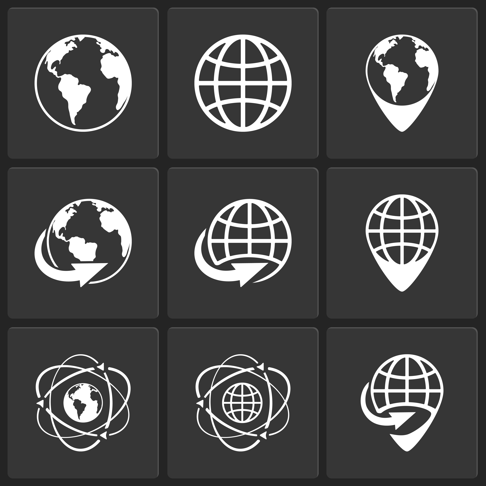

<!--

author:   Pavie Benjamin
email:    training@vib.de
version:  2.0.0
language: en
narrator: UK English Female

icon:     https://vib.be/sites/vib.sites.vib.be/files/logo_VIB_noTagline.svg

comment:  This document shall provide an entire compendium and course on the
          development of Open-courSes with [LiaScript](https://LiaScript.github.io).
          As the language and the systems grows, also this document will be updated.
          Feel free to fork or copy it, translations are very welcome...

script:   https://cdn.jsdelivr.net/chartist.js/latest/chartist.min.js
          https://felixhao28.github.io/JSCPP/dist/JSCPP.es5.min.js

link:     https://cdn.jsdelivr.net/chartist.js/latest/chartist.min.css
link:     https://cdnjs.cloudflare.com/ajax/libs/animate.css/4.1.1/animate.min.css
link:     https://raw.githubusercontent.com/vibbits/material-liascript/master/img/org.css
link:     https://cdnjs.cloudflare.com/ajax/libs/font-awesome/5.11.2/css/all.min.css
link:     https://fonts.googleapis.com/css2?family=Saira+Condensed:wght@300&display=swap
link:     https://fonts.googleapis.com/css2?family=Open+Sans&display=swap
link:     https://raw.githubusercontent.com/vibbits/material-liascript/master/vib-styles.css

tutor:    Neuropixels
edition:  1st 

@JSONLD
<script run-once>
  let json = @0 

  const script = document.createElement('script');
  script.type = 'application/ld+json';
  script.text = JSON.stringify(json);

  document.head.appendChild(script);

  // this is only needed to prevent and output,
  // as long as the result of a script is undefined,
  // it is not shown or rendered within LiaScript
  console.debug("added json to head")
</script>
@end

orcid:    [@0](@1)<!--class="orcid-logo-for-author-list"-->
-->

# Bioimaging data analysis on the HPC

```json   @JSONLD
{
  "@context": "https://schema.org/",
  "@type": "LearningResource",
  "@id": "https://elixir-europe-training.github.io/ELIXIR-TrP-TeSS/",
  "http://purl.org/dc/terms/conformsTo": {
    "@type": "CreativeWork",
    "@id": "https://bioschemas.org/profiles/TrainingMaterial/1.0-RELEASE"
  },
  "description": "Bioimaging data analysis on the HPC.",
  "keywords": "BioImage, Microscopy, Analysis, HPC, Napari, Globus, Jupyter, Python",
  "name": "Bioimaging data analysis on the HPC",
  "license": "https://creativecommons.org/licenses/by/4.0/",
  "educationalLevel": "beginner",
  "competencyRequired": "none",
  "teaches": [
    "Understand the scientific high-performance computing(HPC) infrastructure",
    "Learn to access to the supercomputer infrastructures in Flanders (VSC)",
    "Transfert, store bioimage/microscopy dataset on the VSC",
    "Find and load modules available on the VSC to analyze the bioimage/microscopy dataset",
    "Understand the benefit of using the HPC/VSC infrastructure to analyze bioimage/microscopy dataset",
    "Run pre-installed solution on the HPC/VSC (Ilastik/Fiji/Napar...) for bioimage analysis tasks (segmentation, denoising etc...)",
    "Run image analysis pipeline using a jupyter notebook",
    "Adapting existing solution (zerocost, bioimage zoo) on the VSC",
    "Discuss how to improve reproducibility in image analysis"
  ],
  "audience": "biologist, bio-image-analyst",
  "inLanguage": "en-US",
  "learningResourceType": [
    "tutorial"
  ],
  "author": [
    {
      "@type": "Person",
      "name": "Tatiana Woller" 
    },
    {
      "@type": "Person",
      "name": "Benjamin Pavie"
    }
  ],
  "contributor": [
    {
      "@type": "Person",
      "name": "Sebastian Munck"
    }
  ]
}
```


<section>

Hello and welcome to our @tutor workshop! We are very happy to have you here.

This is the @edition edition of this workshop, jointly organised by BioImaging Core Leuven in partnership with VSC.



Example image to ilustrate the front page of the material. This image was [Designed by macrovector / Freepik](https://www.freepik.com/free-vector/globe-earth-world-icons-vector-white-black_10601425.htm#fromView=author&page=1&position=27&uuid=726a85e1-abc9-4f55-a242-bdb7cd5733f1)

> We are using the interactive Open Educational Resource online/offline course infrastructure called LiaScript.
> It is a distributed way of creating and sharing educational content hosted on github.
> To see this document as an interactive LiaScript rendered version, click on the
> following link/badge: [LiaScript](https://liascript.github.io/course/?https://raw.githubusercontent.com/vibbits/training_material_template/main/README.md)

## General context

Welcome to our {{workshop_name}} workshop! We are very happy to have you here.

This is the {{workshop_edition}} edition of this workshop, jointly organised by the VIB Bioimaging Core, Leuven, BE.

- The session (10 October 2024) is dedicated to .

The **presentation** which goes alongside this material can be found [here](link).

## Schedule

Schedule:

- 09:30 - Introduction
- 10:00 - HPC infrastucture
- 10:30 - Coffee Break
- 10:45 - Data Transfer
- 11:15 - Napari
- 12:15 - Lunch
- 13:15 - Napari plugins
- 14:30 - Coffee break
- 14:45 - Jupyter notebooks
- 17:00 - End of the day
</section>

# Lesson overview

> <i class="fa fa-lock"></i> **License:** [Creative Commons Attribution share alike 4.0 International  License](https://creativecommons.org/licenses/by-sa/4.0/deed.en)
>
> <i class="fa fa-user"></i> **Target Audience:** Researchers, biologis
>
> <svg xmlns="http://www.w3.org/2000/svg" height="14" width="16" viewBox="0 0 576 512"><!--!Font Awesome Free 6.5.1 by @fontawesome - https://fontawesome.com License - https://fontawesome.com/license/free Copyright 2023 Fonticons, Inc.--><path d="M384 64c0-17.7 14.3-32 32-32H544c17.7 0 32 14.3 32 32s-14.3 32-32 32H448v96c0 17.7-14.3 32-32 32H320v96c0 17.7-14.3 32-32 32H192v96c0 17.7-14.3 32-32 32H32c-17.7 0-32-14.3-32-32s14.3-32 32-32h96V320c0-17.7 14.3-32 32-32h96V192c0-17.7 14.3-32 32-32h96V64z"/></svg> **Level:** Beginner  
>
> <i class="fa fa-arrow-left"></i> **Prerequisites**  
> To be able to follow this course, learners should have knowledge in:
> 
> 1. Basic knowlegde of Microscopy  
> 2. Basic knowledge of BioImage Analysis 
>
> <i class="fa fa-bookmark"></i> **Description**  This course consist of .....
> 
> <i class="fa fa-arrow-right"></i> **Learning Outcomes:**  
> By the end of the course, learners will be able to:
>
> 1. Define what ..... [Remembering] 
>
> 2. Discuss and explain ..... [Understanding] 
>
> 3. Apply and modify ..... [Applying] 
>
> 4. Compare ..... [Analysing] 
>
> 5. Evaluate and select ..... [Evaluating] 
>
> 6. Create and integrate ..... [Creating]
>
>> Check more about 
>
> <i class="fa fa-hourglass"></i> **Time estimation**: 120 minutes
>
> <i class="fa fa-asterisk"></i> **Requirements:** The (technical) installation requirements are described in the [installations](https://vibbits-nextflow-workshop.readthedocs.io/en/latest/installations.html) section.
>
> <i class="fa fa-envelope-open-text"></i> **Supporting Materials**:
> 
> 1. [Exercises and solutions](https://github.com/vibbits/nextflow-workshop)
> 2. [Slides]()  
> 
> <i class="fa fa-life-ring"></i> **Acknowledgement**:
>
> * [VIB Technologies](https://www.vib.be/)
> * [Vlaams Supercomputer Centrum - VSC](https://www.vscentrum.be/)
>
> <i class="fa fa-money-bill"></i> **Funding:** .
>
> <i class="fa fa-anchor"></i> **PURL**:  


# Authors and Contributors

Authors

- [Benjamin Pavie](@[orcid](https://orcid.org/0000-0002-0249-3844)

Contributors

- [Tatiana Woller](@[orcid](https://orcid.org/))
- [Sebastian Munck](@[orcid](https://orcid.org/0000-0002-5182-5358))

## Citing this lesson

Please cite as:

  1. ...

# Chapters List

| Chapter | Title                                                   |
| :---- | :------------------------------------------------         |
| 0     | [Get ready for the course, instalation and pre-reading](link) |
| 1     | [Chapter title](link)                                             |
| 2     | [Chapter title](link)                                             |
| 3     | [Chapter title](link)                                             |


# References

Here are some great tips for learning and to get inspired for writing your own pipelines:

- VSC Tier 1 documentation ([link](https://docs.vscentrum.be/hardware-tier1.html))
- Globus ([link](https://www.globus.org/))
- EasyBuild([link](https://docs.easybuild.io/))
- QuPath ([link](https://qupath.readthedocs.io))
- QuPath ([link](https://qupath.readthedocs.io))
- Napari ([link](https://napari.org))
- DevBio ([link](https://github.com/haesleinhuepf/devbio-napari))
- BioImage Analysis Notebooks from Robert Haase([link](https://haesleinhuepf.github.io/BioImageAnalysisNotebooks/intro.html))

# About us

*About VSC*

The Flemish Supercomputer Center (Vlaams Supercomputer Centrum - VSC) is a partnership between the five Flemish universities and their university associations: Associatie Universiteit & Hogescholen Antwerpen, Universitaire Associatie Brussel, Associatie Universiteit Gent, Associatie KU Leuven and Associatie Universiteit-Hogescholen Limburg. This consortium brings together knowhow in scientific and technical computing (including high performance computing, high throughput computing, cloud computing and data processing) in Flanders, and houses infrastructure in four hubs: the datacenters of the universities of Antwerp, Brussels, Ghent and Leuven. The VSC is managed by the Research Fund – Flanders (FWO).

*About VIB and VIB Technologies*

VIB is an entrepreneurial non-profit research institute, with a clear focus on groundbreaking strategic basic research in life sciences and operates in close partnership with the five universities in Flanders – Ghent University, KU Leuven, University of Antwerp, Vrije Universiteit Brussel and Hasselt University.

As part of the VIB Technologies, the 12 VIB Core Facilities, provide support in a wide array of research fields and housing specialized scientific equipment for each discipline. Science and technology go hand in hand. New technologies advance science and often accelerate breakthroughs in scientific research. VIB has a visionary approach to science and technology, founded on its ability to identify and foster new innovations in life sciences.

The goal of VIB Technology Training is to up-skill life scientists to excel in the domains of VIB Technologies, Bioinformatics & AI, Software Development, and Research Data Management.

--------------------------------------------

*Editorial team for this course*
Authors: @[orcid(Benjamin Pavie)]([https://orcid.org/0000-0001-6691-4233](https://orcid.org/0000-0002-0249-3844)), @[orcid(Tatian Woller)](https://orcid.org/)

License: [](https://creativecommons.org/licenses/by-sa/4.0/deed.en)

